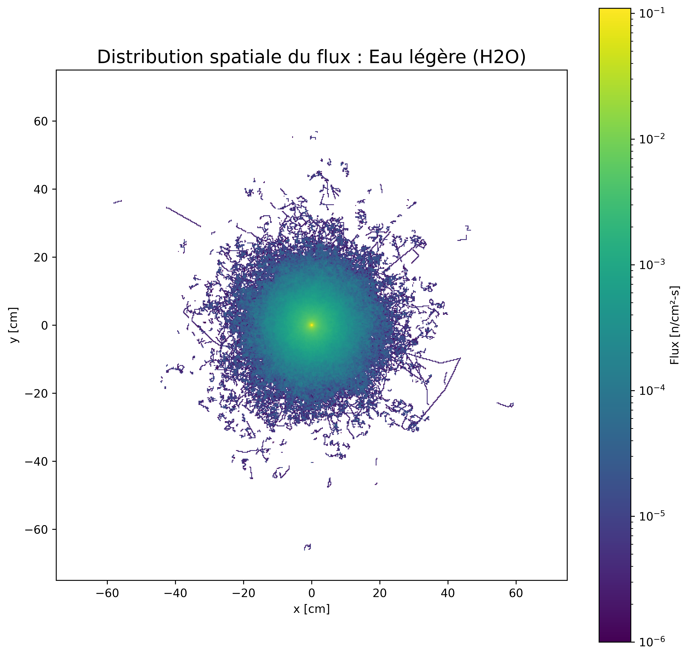

# Iso-distance neutron moderators study
Iso-distance comparative analysis of neutron flux distribution in spherical moderators (H2O, D2O, Graphite) using OpenMC Monte Carlo simulations.

**Author:** Clément Daroussin  
**Field:** Monte Carlo neutron transport simulation
**Tools:** OpenMC, Python, Jupyter

---

## Context
This is a self-initiated theoretical study focusing on the moderating properties of light water, heavy water, and graphite in a spherical geometry. The goal is to visualize and compare the moderating properties of the materials and how it affects the spatial distribution of neutron flux.

---

## 📊 Visual Results (Flux Distribution)

Comparing the spatial distribution of the neutron flux across the three materials ($R = 125$ cm):

| Light Water ($H_2O$) | Graphite ($C$) | Heavy Water ($D_2O$) |
| :---: | :---: | :---: |
|  |  |  |

---

## Simulation Parameters
- **Geometry :** Homogeneous spheres ($R = 125$ cm)
- **Source :** Neutron point source at $(0,0,0)$ using a **Watt fission spectrum**.
- **Materials :** Light water ($H_2O$), heavy Water ($D_2O$), and graphite ($C$).
- **Computational Power :** 1,000,000 particles per batch across 10 batches.
- **Tallies & Metrics :**
    - **Spatial Flux :** 2D Mesh Tally ($300 \times 300$ resolution).
    - **Energy Spectrum :** Log-spaced flux tally ($10^{-5}$ to $10^{7}$ eV).
    - **Time Analysis :** Neutron moderation time distribution (1 ns to 0.01 s).
    - **Balance :** Absorption rate and leakage current (surface tally).

---

## Simulation Performance & Physical Validation

For a standardized run of $10^7$ particles ($300 \times 300$ mesh), the recorded runtimes are:
- **Light Water ($H_2O$):** 993 s
- **Graphite:** 2,808 s
- **Heavy Water ($D_2O$):** 6,801 s

## How to view
The main analysis is available in the `.ipynb` notebook included in this repository.
